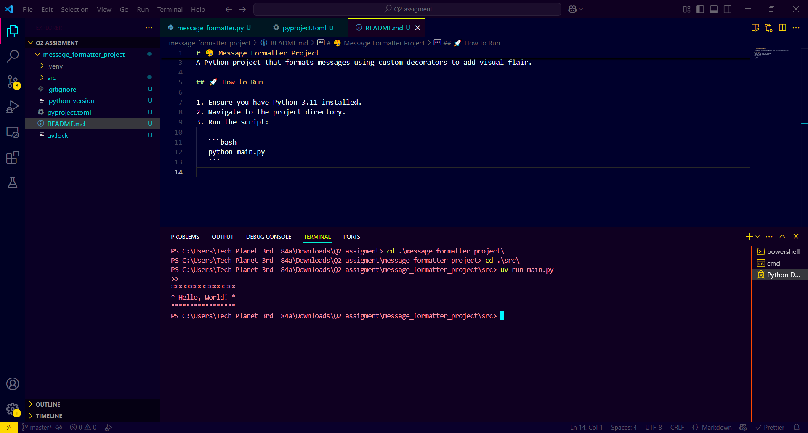

# 🎨 Message Formatter Project

A Python project that formats messages using custom decorators to add visual flair.

## 🚀 How to Run

1. Ensure you have Python 3.11 installed.
2. Navigate to the project directory.
3. Run the script:

   ```bash
   uv run main.py
   ```

## 📸 Terminal Output Screenshot

Here is an example of what the decorated message output looks like in the terminal:


